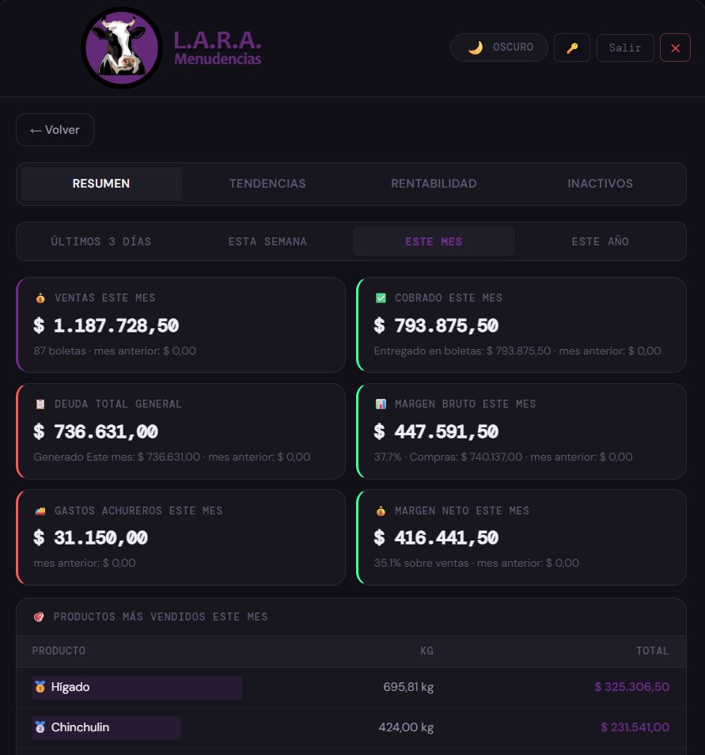
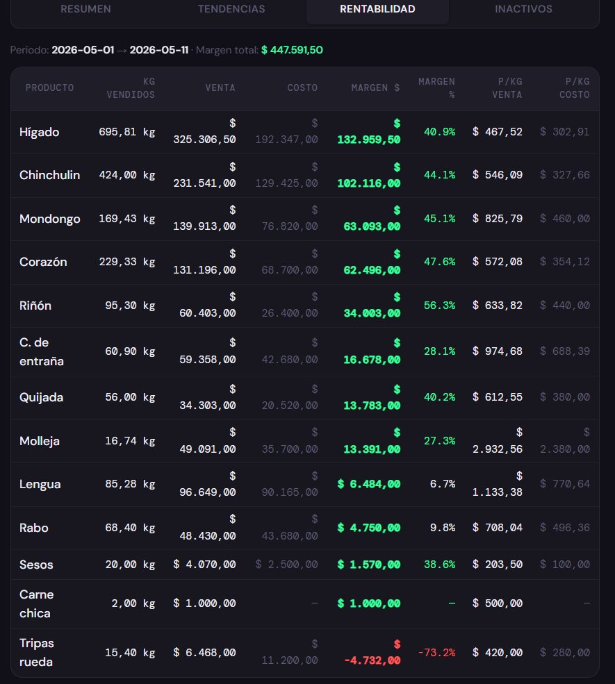
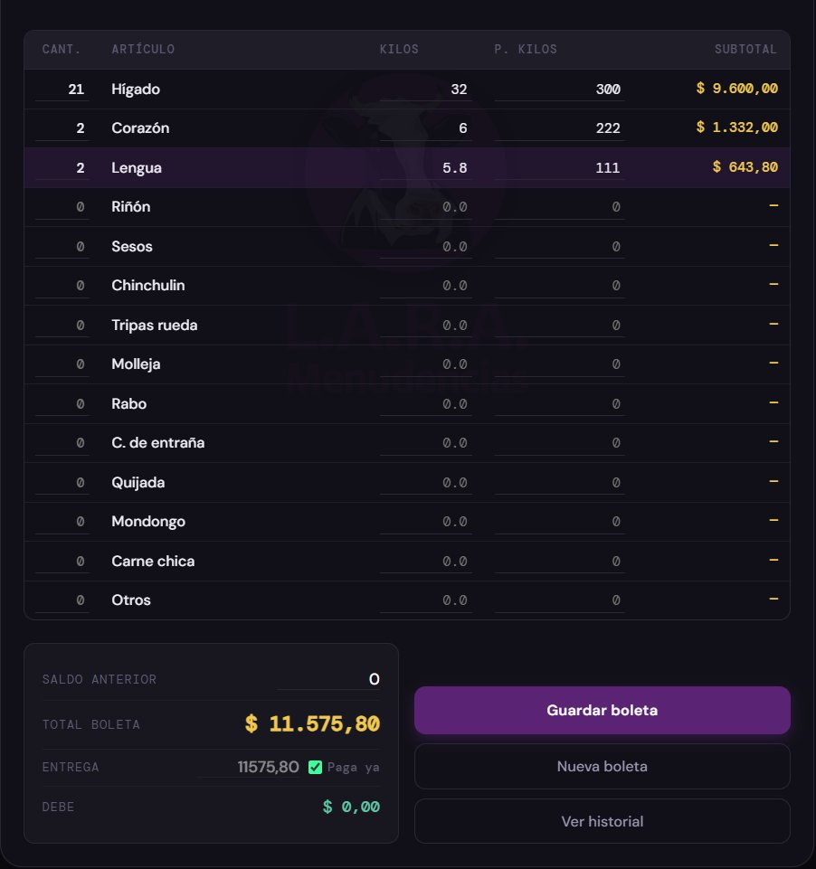
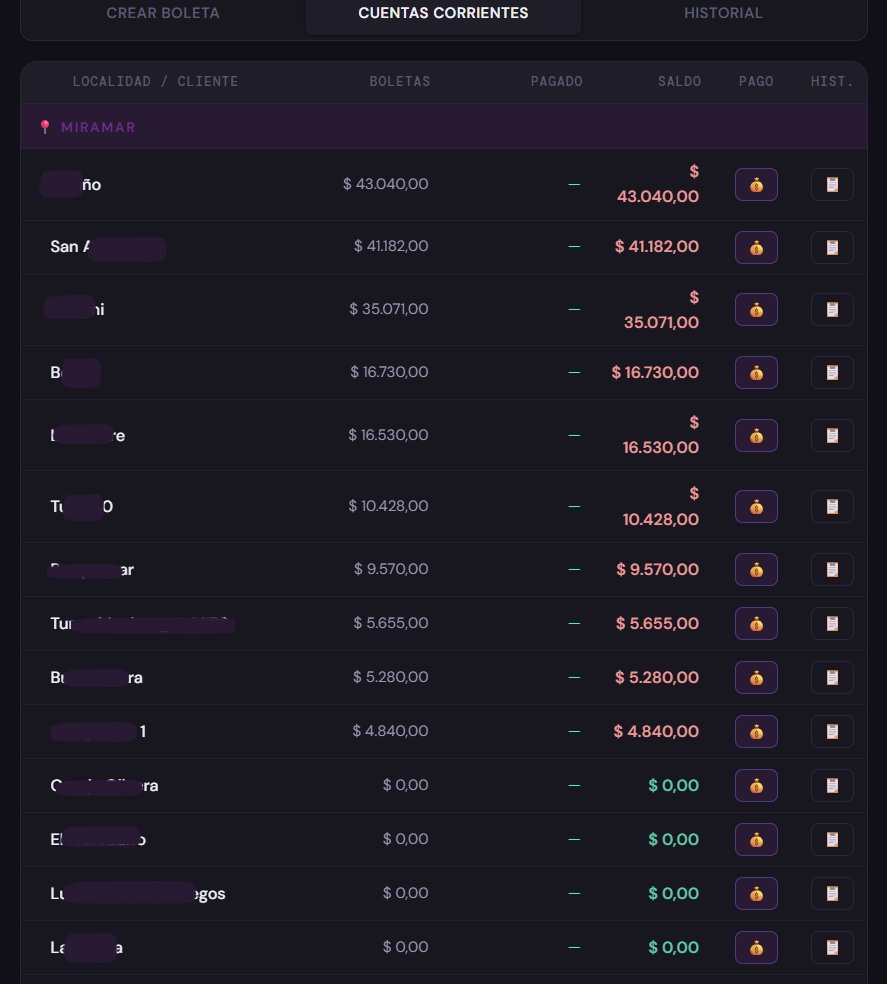
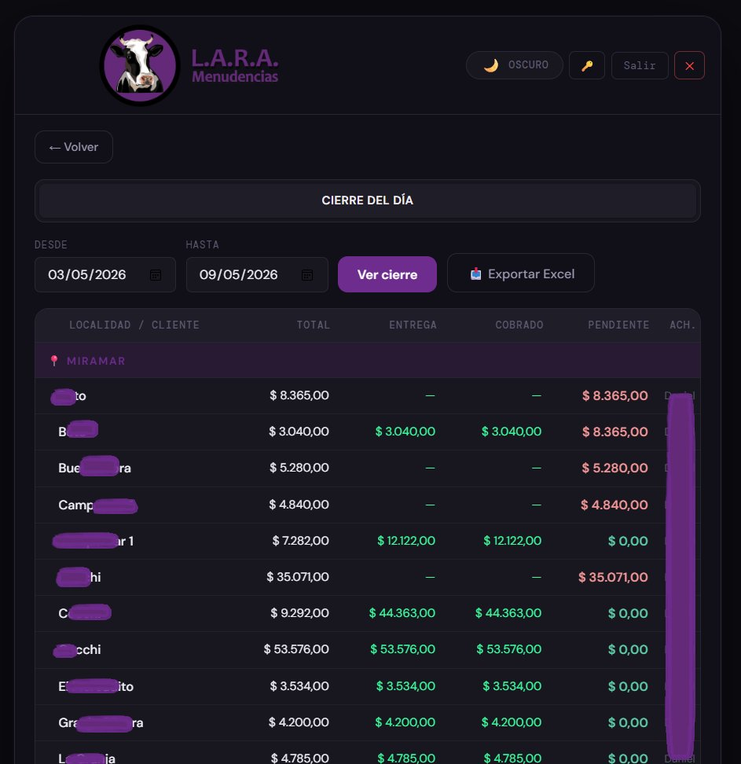

# L.A.R.A SGI — Integrated Management System

> A real-world fullstack business management system built for a meat byproducts distributor in Argentina.  
> Designed, sold, and developed by a single developer. Currently in active implementation with the client.

---

## 📸 Screenshots

| Dashboard — Monthly Summary | Profitability by Product |
|---|---|
|  |  |

| Invoice Creation | Accounts Receivable |
|---|---|
|  |  |

| Daily Closing Report |
|---|
|  |

---

## 🧩 What is L.A.R.A SGI?

L.A.R.A SGI (Integrated Management System) is an internal business management system built to replace a full Excel-based workflow for a meat byproducts distribution company in Miramar, Argentina.

The system handles the complete operational cycle of the business: invoice creation with automatic balance and payment calculation, per-product profitability tracking, client account management grouped by location, and daily analytical reporting with date-range filters.

---

## ⚙️ Tech Stack

| Layer | Technology |
|---|---|
| Backend | Python · FastAPI · SQLAlchemy |
| Database | SQLite → PostgreSQL (migration in progress) |
| Frontend | Vanilla JavaScript · HTML · CSS |
| Design | Custom design system — CSS variables · Syne / DM Sans / DM Mono · Industrial dark palette |
| Packaging | PyWebView · PyInstaller · Inno Setup |

---

## ✅ Features — Current (Implemented)

**Authentication**
- Cookie-based session login and logout
- Password change functionality

**Invoice Management**
- Create, edit, and delete invoices with semantic ID generation
- Automatic previous balance calculation
- Automatic payment registration on delivery (non-editable, flagged as AUTO)

**Accounts Receivable**
- Full account history with filters by date, client, and location
- Accounts grouped by geographic location

**Pricing**
- General price list management
- Per-client special pricing

**Stock**
- Theoretical stock calculated from last manual count
- Purchase logging and history

**Master Data (Full CRUD)**
- Clients · Suppliers · Products · Vendors
- Drag & drop reordering for all entities

**Analytics Dashboard**
- Period-over-period comparisons (today / week / month / year vs previous period)
- Per-product profitability table: kg sold · revenue · cost · margin $ · margin %
- Daily closing report with date-range filters and Excel export
- Product sales ranking

---

## 🚧 Roadmap — In Progress

- [ ] Desktop app packaging with PyWebView + PyInstaller (native window, no visible browser)
- [ ] Native installer via Inno Setup (wizard-style setup, generates desktop shortcut)
- [ ] PostgreSQL migration for production
- [ ] PDF export of daily closing report in company-specific format

---

## 🏗️ Architecture Overview

```
client (browser / desktop window via PyWebView)
        │
        ▼
FastAPI (REST API)
        │
        ├── SQLAlchemy ORM
        │         │
        │         ▼
        │     SQLite (dev) → PostgreSQL (prod)
        │
        └── Static files (HTML · CSS · JS)
```

---

## 🚀 Running Locally

```bash
# Clone the repository
git clone https://github.com/MarAHS99/LARA-SGI.git
cd LARA-SGI

# Create virtual environment
python -m venv venv
source venv/bin/activate  # Windows: venv\Scripts\activate

# Install dependencies
pip install -r requirements.txt

# Run the development server
uvicorn main:app --reload
```

> ⚠️ Source code available upon request. Contact: aguirre.marcelo.ext@gmail.com

---

## 👨‍💻 Developer

**Marcelo Nazareth Aguirre**  
Fullstack Developer · La Plata, Argentina

[](https://www.linkedin.com/in/marcelo-nazareth-aguirre-aa4a94251/)
[](https://github.com/MarAHS99)
[](mailto:aguirre.marcelo.ext@gmail.com)

---

## 📄 License

© 2026 Marcelo Nazareth Aguirre. All Rights Reserved. See [LICENSE](LICENSE) for details.

---

*Built with Python · FastAPI · SQLAlchemy · SQLite · HTML · CSS · JavaScript*
